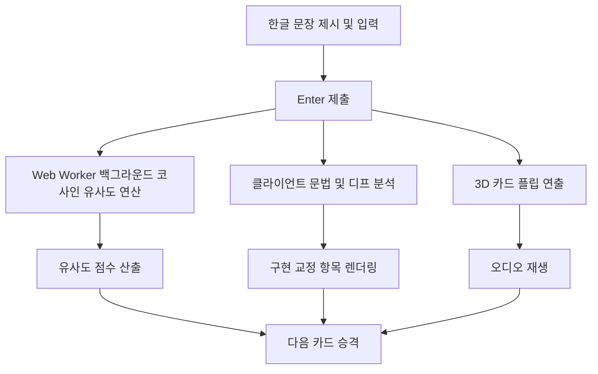

# Translation Master

웹 기반 한영 문장 번역 및 암기 학습 애플리케이션입니다.  
Live URL: https://translation-game-khaki.vercel.app  
Repository: https://github.com/lee04jinwoo-sys/translation-game

---

## 목차
1. 개요
2. 시스템 아키텍처
3. 주요 기능
4. 예문 데이터베이스
5. 디렉토리 구조
6. 단축키
7. 로컬 실행 가이드

---

## 1. 개요

Translation Master는 한글 문장을 보고 대응하는 영어 문장을 직접 입력한 후, 3D 카드 플립 애니메이션과 온디바이스 AI 유사도 채점 및 오디오 재생을 통해 정답을 확인하는 학습 도구입니다.

---

## 2. 시스템 아키텍처



---

## 3. 주요 기능

### 3D 카드 덱 스택 및 전환
- 상단 카드(`deck[0]`) 뒤에 2번 카드(`deck[1]`)를 사전 렌더링하여 스택 형태로 배치합니다.
- 카드 카드가 넘어갈 때 350ms CSS 트랜지션을 사용하여 승격 처리합니다.
- 연타로 인한 스킵을 방지하기 위해 0.8초 쿨다운을 적용했습니다.

### Web Worker 기반 온디바이스 채점 엔진
- Xenova Transformers.js를 사용하여 브라우저 내부에서 문장 간 코사인 유사도를 연산합니다.
- 메인 스레드 블로킹을 방지하기 위해 별도의 Web Worker 스레드에서 처리합니다.

### 듀얼 오디오 엔진
- Primary Engine: Google Cloud Text-to-Speech API
- Fallback Engine: 브라우저 내장 Web Speech API (`window.speechSynthesis`)

### 클라이언트 구조 분석 및 디프
- 외부 API 의존 없이 자바스크립트 내장 디프 및 문법 검사기를 통해 전치사, 관사, 시제, 주요 어휘 차이를 검출합니다.

### 우측 호버 서랍 패널
- 평소에는 화면 우측 탭 형태로 최소화되어 있으며, 마우스 호버 시 최신 풀이 이력 및 보관함 패널이 확장됩니다.

### Anki CSV 내보내기
- 보관된 문장을 Anki 호환 CSV 파일로 변환하여 다운로드할 수 있습니다.

---

## 4. 예문 데이터베이스

Tatoeba 프로젝트에서 추출한 1,000개의 한-영 문장 데이터를 다룹니다.

| 난이도 | CEFR | 데이터 기준 | 예문 |
| :--- | :--- | :--- | :--- |
| Lv.1 | A1 | 기초 단문 | Who am I? |
| Lv.2 | A2 | 필수 구문 | Do you know who I am? |
| Lv.3 | B1 | 구동사 및 접속사 | All I can do is to do my best. |
| Lv.4 | B2 | 가정법 및 복합문 | I was about to go to bed when he called me up. |
| Lv.5 | C1 / C2 | 고급 문장 | To be a good translator, I think Tom needs to hone his skills a bit more. |

- 매트릭스 구성: 5개 난이도 x 4개 주제 (일상, 여행, 비즈니스, 학교) = 총 1,000개 고유 문장
- 데이터 파일 경로: `public/sentences.json`

---

## 5. 디렉토리 구조

```text
translation-game/
├── public/
│   └── sentences.json          # 1,000개 영-한 문장 데이터베이스
├── src/
│   ├── components/             # React UI 컴포넌트
│   │   ├── CardGame.tsx        # 카드 플립, 채점 및 오디오 재생 처리
│   │   ├── CustomDeckModal.tsx # 난이도 및 주제 선택 설정 모달
│   │   ├── Header.tsx          # 앱 상단 렌더링 컴포넌트
│   │   ├── LeftSidebar.tsx     # 좌측 통계 및 상태 제어 패널
│   │   └── RightSidebar.tsx    # 우측 이력 및 Anki 보관함 패널
│   ├── lib/                    # 유틸리티 및 엔진 함수
│   │   ├── ai.worker.ts        # Transformers.js 기반 인베딩 연산 스레드
│   │   ├── difficulty.ts       # CEFR 난이도 태깅 정의
│   │   ├── grammar.ts          # 클라이언트 단어 및 구조 분석기
│   │   └── sentenceLoader.ts   # sentences.json 로드 및 셔플 로직
│   ├── App.tsx                 # 애플리케이션 진입점 및 전역 상태 관리
│   └── index.css               # 스타일 및 애니메이션 정의
├── .env                        # 환경 변수 정의
├── vercel.json                 # Vercel 캐시 제어 설정
├── package.json                # 프로젝트 메타데이터 및 의존성
└── README.md                   # 프로젝트 기술 문서
```

---

## 6. 단축키

| 단축키 | 기능 |
| :--- | :--- |
| Enter | 제출 (앞면) / 다음 카드로 이동 (뒷면) |
| Shift + Enter | 멀티라인 줄바꿈 |
| Tab | 음성 인식(STT) 토글 |
| D | 덱 가져오기 / 조건 설정 모달 열기 |
| A / S | 현재 카드 Anki 보관함 저장 후 다음 카드 이동 |
| R / V | 오디오 다시 듣기 |
| Esc | 모달 닫기 |

---

## 7. 로컬 실행 가이드

### 패키지 설치
```bash
npm install
```

### 개발 서버 실행
```bash
npm run dev
```
접속 주소: `http://localhost:5173`

---

## 라이선스

MIT License
Sentence Data: Tatoeba Project (CC BY 2.0 FR)
