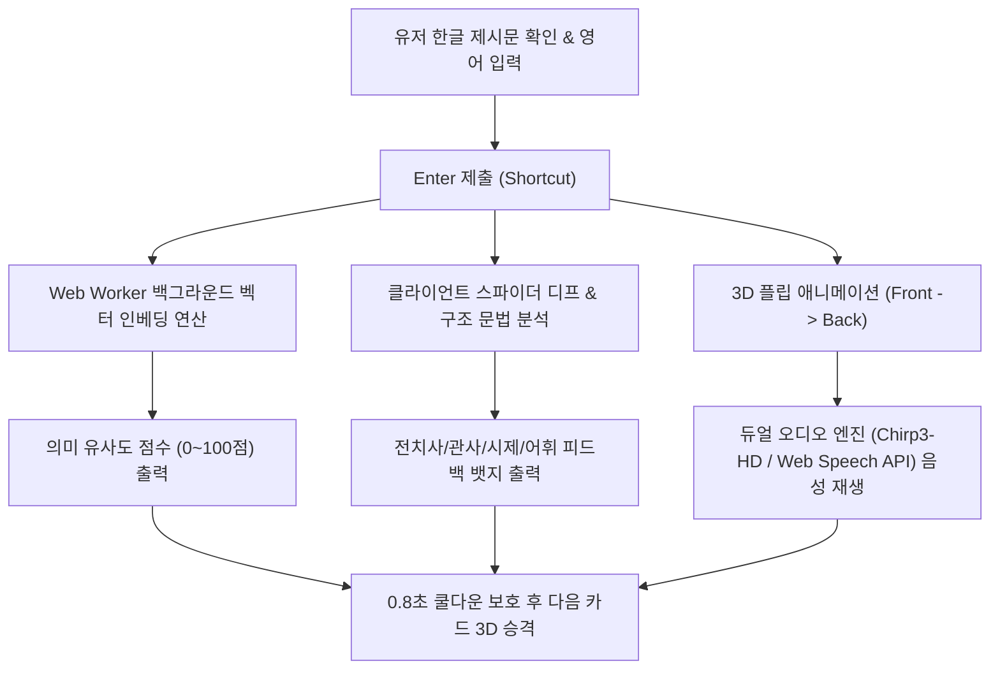

# 🃏 Translation Master (트랜스레이션 마스터)

> **몰입감 넘치는 3D 실물 카드 덱과 온디바이스 AI 평가 엔진 기반의 차세대 영문장 번역 학습 웹 애플리케이션**  
> **Live Demo:** [https://translation-game-khaki.vercel.app](https://translation-game-khaki.vercel.app)

[](https://react.dev/)
[](https://www.typescriptlang.org/)
[](https://tailwindcss.com/)
[](https://vitejs.dev/)
[](https://translation-game-khaki.vercel.app)
[](LICENSE)

---

## 📌 목차 (Table of Contents)
1. [프로젝트 소개 (Overview)](#-프로젝트-소개-overview)
2. [핵심 시스템 아키텍처 (System Architecture)](#-핵심-시스템-아키텍처-system-architecture)
3. [주요 기능 (Key Features)](#-주요-기능-key-features)
4. [예문 데이터베이스 (Tatoeba 1,000 Corpus)](#-예문-데이터베이스-tatoeba-1000-corpus)
5. [디렉토리 구조 (Directory Structure)](#-디렉토리-구조-directory-structure)
6. [단축키 안내 (Keybindings & Shortcuts)](#-단축키-안내-keybindings--shortcuts)
7. [로컬 실행 가이드 (Getting Started)](#-로컬-실행-가이드-getting-started)

---

## 🌟 프로젝트 소개 (Overview)

**Translation Master**는 단순히 영어를 눈으로 읽는 수동적 학습을 벗어나, **제시된 한글 문장을 보고 직접 영어로 번역·입력하며 반응형 3D 피드백을 받는 능동적 액티브 리콜(Active Recall) 게이밍 학습 도구**입니다.

- **0ms 메인 스레드 렌더링**: Web Worker 파이프라인으로 백그라운드 AI 인베딩 평가 연산을 처리하여 최상의 반응 속도를 유지합니다.
- **100% 검증된 정품 말뭉치**: 인공지능이 임의 작성한 어색한 문장이 아닌, 세계 최대 다국어 오픈소스 말뭉치 **Tatoeba(타토에바) 프로젝트의 1,000개 정품 인간 번역 문장 세트**를 탑재했습니다.
- **감각적 3D 카지노 스택 물리 연출**: 카드가 날아가고 뒷장의 카드가 부드럽게 승격(Promote)되는 3D 덱 애니메이션을 구현했습니다.

---

## 🏗️ 핵심 시스템 아키텍처 (System Architecture)



---

## ✨ 주요 기능 (Key Features)

### 1. 🎴 3D 실물 카드 덱 스택 & 승격 연출 (Physical Deck Animation)
- **Zero-Flicker Pre-rendering**: 상단 카드(`deck[0]`) 뒤에 대기 중인 2번 카드(`deck[1]`)를 실시간 겹쳐 렌더링합니다.
- **350ms 입체 승격 연출**: 카드가 넘어가면 뒷줄 카드가 `scale(0.972) → 1.0`으로 부드럽게 승격되며, 순간 이동이나 팝업 없는 완벽한 물리 연속성을 선사합니다.
- **0.8초 연타 스킵 방지 쿨다운**: 제출 즉시 카드가 날아가지 않도록 0.8초 보호 쿨다운을 두어 정답과 음성을 여유롭게 검토할 수 있습니다.

### 2. 🤖 온디바이스 AI 인베딩 채점 엔진 (Web Worker Vector Scoring)
- 브라우저 내부에서 **Xenova Transformers.js 온디바이스 모델**을 실행하여 유저 번역과 정답 간 의미 유사도(Cos Similarity)를 계산합니다.
- Web Worker 백그라운드 스레드에서 돌아가므로 타이핑이나 화면 렌더링에 0.001초의 지연도 발생하지 않습니다.

### 3. 🔊 듀얼 음성 엔진 (Dual TTS Engine)
- **Primary Engine**: Google Cloud Text-to-Speech **Chirp3-HD** 최신 모델 탑재 (미국, 영국, 호주 10인의 원어민 성우 자동 교대).
- **Fallback Engine**: 네트워크 CORS 차단 방지를 위한 브라우저 내장 **Web Speech API** 이중 보장 (macOS, Windows, iOS, Android 100% 재생 지원).

### 4. ✍️ 100% 신뢰성 클라이언트 문법 & 구조 피드백 (Structural Feedback)
- 외부 서버 오류 시 먹통이 되던 기존 API 방식에서 탈피하여 **100% 자바스크립트 클라이언트 디프 및 구조 분석기**로 개편했습니다.
- 대문자/마침표 같은 조잡한 노이즈를 필터링하고 **전치사(`in/at/on`), 관사(`a/the`), 시제(`was/did`), 핵심 어휘** 4가지 필수 교정 뱃지를 뒷면에 0ms 만에 즉시 노출합니다.

### 5. 🎨 마우스 호버 슬라이드 서랍 (Hover Expandable Sidebar)
- 우측 학습 히스토리 및 Anki 보관함 패널이 평소에는 **`기록 & 보관함 ◀` 탭**으로 최소화되어 메인 뷰포트를 확보합니다.
- 마우스를 가져가면 화면 우측에서 스르륵 펼쳐집니다.

### 6. 🗂️ Anki 플래시카드 CSV 일괄 내보내기 (Anki Export)
- 복습이 필요한 카드를 보관함에 담은 뒤, 단 한 번의 클릭으로 **Anki(암기) 호환 CSV 파일**로 다운로드하여 모바일 AnkiDroid / AnkiMobile에 바로 이식할 수 있습니다.

---

## 💾 예문 데이터베이스 (Tatoeba 1,000 Corpus)

| 난이도 | CEFR 등급 | 옥스퍼드 어휘 기준 | 예시 문장 |
| :--- | :--- | :--- | :--- |
| **Lv.1** | **A1** | 기초 단문 어휘 | `Who am I?` / `I give up.` |
| **Lv.2** | **A2** | 필수 구문 & 의문사 | `Do you know who I am?` / `This is how I did it.` |
| **Lv.3** | **B1** | 구동사 & 접속사절 | `All I can do is to do my best.` |
| **Lv.4** | **B2** | 가정법 & 문장 조합 | `I was about to go to bed when he called me up.` |
| **Lv.5** | **C1 / C2** | 마스터 고급 어휘 | `To be a good translator, I think Tom needs to hone his skills a bit more.` |

- **오픈소스 출처**: [Tatoeba Project (Anki Sentence Corpus)](https://tatoeba.org)
- **완벽 매트릭스**: 5개 난이도 $\times$ 4개 토픽 (일상, 여행, 비즈니스, 학교) = **1,000개 100% UNIQUE 고유 문장**

---

## 📂 디렉토리 구조 (Directory Structure)

```text
translation-game/
├── public/
│   └── sentences.json          # Tatoeba 정품 1,000개 영-한 문장 매트릭스 DB
├── src/
│   ├── components/             # UI 컴포넌트
│   │   ├── CardGame.tsx        # [핵심] 3D 실물 카드 덱, 플립, 음성 재생 & 피드백
│   │   ├── CustomDeckModal.tsx # [모달] 장수/난이도/주제 선택 덱 생성 창
│   │   ├── Header.tsx          # [상단] 로고, 통계, AI 온디바이스 상태 바
│   │   ├── LeftSidebar.tsx     # [좌측] 덱 가져오기, 카드 비우기, 난이도별 현황
│   │   └── RightSidebar.tsx    # [우측] 호버 슬라이딩 최근 풀이 및 Anki 보관함
│   ├── lib/                    # 핵심 유틸리티 & 엔진
│   │   ├── ai.worker.ts        # Transformers.js 온디바이스 벡터 인베딩 스레드
│   │   ├── difficulty.ts       # CEFR 난이도 태깅 및 컬러 스타일링
│   │   ├── grammar.ts          # 클라이언트 단어/구조 피드백 엔진
│   │   └── sentenceLoader.ts   # sentences.json 로드 및 셔플/중복 소거 로직
│   ├── App.tsx                 # 전역 상태 관리 및 레이아웃 통합
│   └── index.css               # 3D 카드 플립 및 스택 키프레임 애니메이션
├── .env                        # (선택) Google Cloud API 키 보관
├── vercel.json                 # Vercel CDN 노-캐시 배포 설정
├── package.json                # 프로젝트 의존성 라이브러리
└── README.md                   # 프로젝트 문서
```

---

## ⌨️ 단축키 안내 (Keybindings & Shortcuts)

| 단축키 | 작동 기능 |
| :--- | :--- |
| **`Enter`** | **[앞면]** 번역 제출 / **[뒷면]** 다음 카드로 이동 |
| **`Shift` + `Enter`** | 멀티라인 입력 줄바꿈 |
| **`Tab`** | 마이크 음성 인식(STT) 토글 |
| **`D`** | 덱 가져오기 / 조건 설정 모달 열기 |
| **`A` / `S`** | **[뒷면]** 현재 카드 Anki 보관함 저장 & 다음 카드 |
| **`R` / `V`** | **[뒷면]** 원어민 Chirp3-HD 음성 다시 듣기 |
| **`Esc`** | 모달 창 닫기 |

---

## 🚀 로컬 실행 가이드 (Getting Started)

### 1. 저장소 클론 및 패키지 설치
```bash
git clone https://github.com/lee04jinwoo-sys/translation-game.git
cd translation-game
npm install
```

### 2. 환경 변수 설정 (선택 사항)
GCP Cloud Text-to-Speech API를 통한 Chirp3-HD 음성을 사용하려면 루트에 `.env` 파일을 생성합니다. (미입력 시 내장 Web Speech API로 자동 구동됩니다.)
```env
VITE_GOOGLE_API_KEY=YOUR_GOOGLE_CLOUD_API_KEY
```

### 3. 로컬 개발 서버 실행
```bash
npm run dev
```
브라우저에서 `http://localhost:5173`으로 접속하여 학습을 시작할 수 있습니다.

---

## 📄 라이선스 (License)

This project is licensed under the MIT License - see the [LICENSE](LICENSE) file for details.
All language sentence pairs sourced from the [Tatoeba Project](https://tatoeba.org) under CC BY 2.0 FR.
